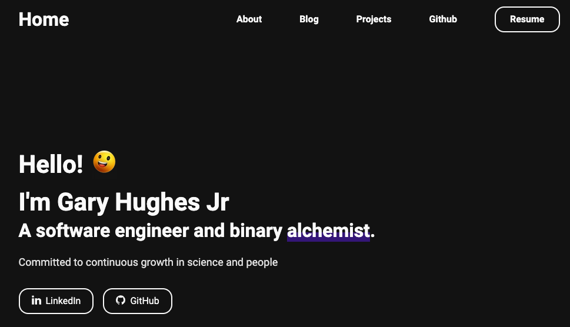

# Personal Porfolio Website

_Gatsby minimal template for building basic portfolio site_

See it [here](https://garyhughesjr.netlify.app/)

# Summary

This is a basic template for getting my projects, resume, and sharing a little about who I am for colleagues, employers, and fellow enthusiasts. It's the first time ever working with a Gatsby template and a learned a lot about how minimal sites can be structured as well as keeping the design simple for easier navigation. 

Deployment was challenging, but also very rewarding due to being able to work through deployment logs, fix errors, and successfully deploying the site. I'm excited to dive deeper into more complex functionality, features, and design in the near future.

# Author

- Gary Hughes Jr - _Full-Stack Developer_ - [Website](https://garyhughesjr.netlify.app/) | [LinkedIn](https://www.linkedin.com/feed/)